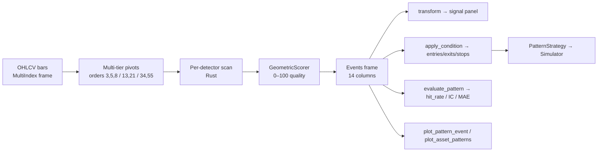

# Chart patterns: end-to-end overview

`fundcloud.features.patterns` ships nine classical chart-pattern
detectors as a first-class feature surface — every detector composes
with `FeaturePipeline`, the simulator, and the `.fc` accessor exactly
like a TA-Lib indicator. Detection runs in pure Rust under
`fundcloud._core`; the Python layer wraps each detector as an
`IndicatorSpec` subclass.

This page is the bird's-eye view. For the runnable recipe, see the
[detection workflow](pattern-detection.md). For every tunable knob, see
[knobs](knobs.md). For the formal contract — schemas, exact validation
rules, every metric — see the [reference](../../reference/patterns.md).

## How it works, end to end



A scan is one function call, but five things happen:

1. **Pivots.** For each asset, the Rust core finds local minima and
   maxima at multiple `pivot_orders`. The default is *three disjoint
   tiers* — `(3,5,8)`, `(13,21)`, `(34,55)` — unioned, so short and
   long formations both surface in one pass.
2. **Detect.** Each detector slides a fixed-shape pivot window
   (3 pivots for double tops, 5 for H&S, etc.) over the merged pivot
   list, applies its structural rules (peak symmetry, neckline slope,
   prior-trend direction, …) and emits a candidate.
3. **Score.** Every candidate is scored 0–100 by `GeometricScorer`:
   `0.30 × symmetry + 0.25 × volume + 0.25 × trendline_r² + 0.20 ×
   completeness`. The score measures *textbookness only* — it is **not**
   a prediction of future return. Outcome modeling lives downstream
   (see [Roadmap](#roadmap)).
4. **Filter.** Detections below `min_quality` are dropped. Surviving
   events are returned as a 14-column dataframe (pivots, breakout
   level, formation window, quality, direction, variant tag).
5. **Project.** `transform()` collapses events into a per-bar signal
   panel using `signal_mode` (`BREAKOUT`, `FORMATION`, or `DECAY`).
   `apply_condition()` fills target / stop / time-stop levels for use
   by `PatternStrategy`.

The whole pipeline is pure — no RNG, no clock, no I/O — so identical
input produces identical output across runs and machines.

## Supported patterns

Nine tier-1 reversal/continuation detectors. All have shipped Rust
implementations and Python wrappers; all support the same multi-tier
pivot scan, the same scorer, the same events schema.

| Family | Class | Direction | Default `condition` |
|---|---|---|---|
| Reversal — top | `HeadAndShoulders` | bearish | `MEASURED_MOVE`, `ABOVE_NECKLINE_PEAK` stop |
| Reversal — top | `DoubleTop` | bearish | `MEASURED_MOVE`, `ABOVE_PIVOT` stop |
| Reversal — top | `TripleTop` | bearish | `MEASURED_MOVE`, `ABOVE_PIVOT` stop |
| Reversal — bottom | `InverseHeadAndShoulders` | bullish | `MEASURED_MOVE`, `BELOW_NECKLINE_TROUGH` stop |
| Reversal — bottom | `DoubleBottom` | bullish | `MEASURED_MOVE`, `BELOW_PIVOT` stop |
| Reversal — bottom | `TripleBottom` | bullish | `MEASURED_MOVE`, `BELOW_PIVOT` stop |
| Continuation | `AscendingTriangle` | bullish | `HEIGHT_PROJECTED`, `BELOW_PIVOT` stop |
| Continuation | `DescendingTriangle` | bearish | `HEIGHT_PROJECTED`, `ABOVE_PIVOT` stop |
| Bilateral | `SymmetricalTriangle` | direction-of-prior-trend | `HEIGHT_PROJECTED`, `ABOVE/BELOW_PIVOT` stop |

The full
[reference](../../reference/patterns.md#detector-reference)
documents each detector's structural rules — minimum bar counts,
shoulder-tolerance bounds, flat-side slope thresholds, prior-trend
windows, and Bulkowski-style variant tags (`"STRICT_ADAM_ADAM"`,
`"STANDARD"`, `"LOOSE"`, …).

## Tuning the parameters

Every threshold is tunable. The
[knobs reference](knobs.md) documents every one with its default,
its decision (exposed / kept hardcoded / planned auto-scale), and
what it changes.

The minimum recipe — three knobs that move performance the most in
practice:

```python
from fundcloud.features.patterns import HeadAndShoulders

indicator = HeadAndShoulders(
    min_quality=70,                 # raise from default 50 for
                                     # higher-precision shortlist
    shoulder_tolerance=0.10,        # how asymmetric the shoulders may be
    prior_trend_window=20,          # bars before left shoulder used to
                                     # confirm the prior up-trend
)
events = indicator.events(bars)
```

The repeatable workflow:

1. **Run with defaults.** Start with `min_quality=50` and
   `pivot_tiers=((3,5,8), (13,21), (34,55))`.
2. **Bucket by quality.**
   `feature_quality.quality_buckets(events, bars, horizon=20, n_buckets=5)`
   tells you whether the scorer separates better events from worse on
   *your* universe. A monotonic Q1 → Q5 lift in `expectancy` means the
   scorer is earning its weight; pick `min_quality` at the floor of the
   best bucket. Flat or anti-monotonic buckets mean the scorer is
   fighting your data — loosen the relevant detector knob (e.g.,
   `peak_tolerance`) or use the
   [inverse trade](pattern-detection.md#inverse-direction-trading-fading-the-pattern)
   path.
3. **Compare hit rate against baseline.**
   `evaluate_pattern(...)` returns both `hit_rate` and `baseline_hit`
   side-by-side. The pattern has edge only if `hit_rate >
   baseline_hit + 5pp` *and* `expectancy > 0` in R-multiples.
4. **Stratify by regime.** `feature_quality.time_stability(...)`
   reports the same stats across five chronological folds. A pattern
   that worked only in one regime is regime-bound — flag it before
   deploying live.

For the quality scorer's exact weights, monotonicity contracts, and
canonical fixture set, see [Quality score](../../scoring/quality.md).

## Estimated runtime

The Rust core is fast; for typical academic-scale studies the bottleneck
is post-processing in Python (events frame construction, projection to
signals, evaluation across horizons), not detection.

Reference numbers, measured on a single Apple-silicon laptop core
against a synthetic OHLCV panel of **10 assets × 5 years of daily
bars** (~12,600 bar-rows total):

| Operation | Time | Notes |
|---|---|---|
| One detector, `events()` (e.g. `DoubleTop`) | 4–6 ms | Reversal patterns |
| One detector, `events()` (e.g. `HeadAndShoulders`, triangles) | 15–17 ms | More expensive — 5-pivot windows or trendline-fitting |
| All 9 patterns, sequential | ~75 ms | ~1.5 ms per asset-year |
| `evaluate_pattern(... horizons=(5,10,20,60))` | ~35 ms | Includes baseline-hit computation |
| `run_pattern(...)` full backtest | ~165 ms | Indicator scan + simulator walk |

How that scales:

- **Linear in bar count.** Doubling the look-back doubles the time.
- **Linear in asset count.** Each asset is scanned independently.
- **Sub-linear in `pivot_tiers`.** Adding a tier costs less than a full
  re-scan because the detector window slides over the union of pivots,
  not the bars themselves. Disabling tiering (`pivot_tiers=()`) shaves
  ~20 % at the cost of missing multi-month formations.
- **`min_quality` is post-filter only** — raising it does not speed up
  detection.

For a hypothetical universe of **500 US equities × 10 years of daily
bars** (~1.25 M bar-rows), expect ~10 s for one detector and ~75–90 s
for all nine — well within an interactive notebook. Daily refresh in
production fits comfortably in a single CPU minute.

For tick-by-tick / streaming, see [Roadmap](#roadmap) — the current
implementation is batch-only.

## Roadmap

The shipped surface (Rust core + 9 detectors + scorer + Python wrappers
+ events frame + condition descriptor + strategy + accessors + plots)
is what the library guarantees today. Items below are in priority order
and are *not* committed delivery dates — they're the design seams left
open in the current codebase.

### Near-term (PR-scoped)

- **Confirmed-breakout mode.** Today `breakout_ts` fires on
  `formation_end`. This systematically inflates `throwback_rate` and
  fires one or two bars before the textbook entry. An opt-in
  `EntryRule.CONFIRMED_BREAKOUT` will require a close-through-neckline
  bar before emitting the event timestamp.
- **Auto-scaled `prior_trend_window`.** Today's `10-bar` default is
  daily-bar-shaped; on weekly bars it covers two months. A planned
  auto-derive will set the window from the input timeframe.
- **Native short side in `PatternStrategy`.** Bearish events are
  currently long-via-`inverse=True`. Direct shorting depends on
  simulator support for naked shorts — tracked there.

### Medium-term (one-PR-per-feature)

- **`ReliabilityScorer`.** A second scorer that blends
  `GeometricScorer` with empirical hit-rate per
  `(direction × timeframe × regime × asset_bucket)`. Output is an
  outcome-aware confidence — strictly **separate** from the geometric
  quality score (which stays a pure-geometry measure).
- **`MLScorer`.** XGBoost predictor of realised R-multiple at a 20-bar
  horizon, trained off the events frame plus standard features.
  Independent from the geometric scorer.
- **Streaming / tick-by-tick path.** The PyO3 layer has the seams for
  an `update_one_bar(...)` style API; today's scan is batch-only.

### Out of scope by design

- **Calibration loops, hand-rating workflows, human-in-the-loop
  feedback.** The library exposes the knobs and the scorer; calibration
  belongs in user code.
- **Tuning the geometric scorer against future returns.** The geometric
  score is a pure-geometry measure; outcome predictiveness is the job
  of `ReliabilityScorer` / `MLScorer`. See
  [Quality score](../../scoring/quality.md) for the rationale.

For the full inventory of *known* limitations (`pivot.order` is
recorded but unused, `breakout_ts` semantics, no regime-aware scorer,
no streaming, etc.), see the
[reference's "Limitations and future work" section](../../reference/patterns.md#limitations-and-future-work).

## Where to go next

- **[Detection workflow](pattern-detection.md)** — the four-step
  research recipe: detect → evaluate → bucket → backtest, with
  copy-pasteable code.
- **[Knobs reference](knobs.md)** — every threshold, window, and weight
  with its default and tunability decision.
- **[Quality score](../../scoring/quality.md)** — composite formula,
  monotonicity contracts, canonical fixtures.
- **[Chart Patterns reference](../../reference/patterns.md)** — formal
  contract: detector validation rules, events schema, condition
  semantics, file map.
- **Examples** — `examples/31`–`36` are runnable end-to-end scripts
  that mirror this guide.
