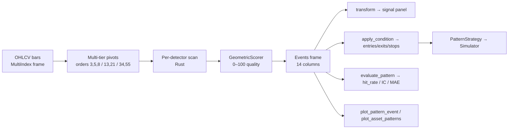

# Chart pattern detection

`fundcloud.features.patterns` is a feature surface for classical chart
patterns — Head and Shoulders, Double / Triple Top and Bottom, the
three triangles. Detection runs in pure Rust under `fundcloud._core`;
the Python layer wraps each detector as an
[`IndicatorSpec`](../../reference/patterns.md#patternindicatorindicatorspec)
subclass so patterns compose with the rest of the feature pipeline,
the simulator, and the `.fc` accessor.

This guide is the end-to-end recipe book — what the pipeline does, what
patterns it ships with, how to use them, what they cost to run, and
what's coming next. For the formal contract (every metric definition,
every Rust detector's validation rules, the exact output schemas) see
the [reference](../../reference/patterns.md). Every tunable knob is
documented in [knobs](knobs.md) — start there if a default is too
strict or too loose for your asset class.

## How it works, end to end



A scan is one function call, but five things happen:

1. **Pivots.** For each asset, the Rust core finds local minima and
   maxima at the configured `pivot_orders`. The default is *three
   disjoint tiers* — short `(3,)`, medium `(13,)`, long `(34,)` —
   each scanned independently and unioned, so short and long
   formations both surface in one pass.
2. **Detect.** Each detector slides a fixed-shape pivot window
   (3 pivots for double tops, 5 for H&S, etc.) over the merged pivot
   list, applies its structural rules (peak symmetry, neckline slope,
   prior-trend direction, …) and emits a candidate.
3. **Score.** Every candidate is scored 0–100 by `GeometricScorer`:
   `0.30 × symmetry + 0.25 × volume + 0.25 × trendline_r² + 0.20 ×
   completeness`. The score measures *textbookness only* — it is **not**
   a prediction of future return. Outcome modeling lives downstream
   (see [Roadmap](#roadmap)).
4. **Filter.** Detections below `min_quality` are dropped. Surviving
   events are returned as a 14-column dataframe (pivots, breakout
   level, formation window, quality, direction, variant tag).
5. **Project.** `transform()` collapses events into a per-bar signal
   panel using `signal_mode` (`BREAKOUT`, `FORMATION`, or `DECAY`).
   `apply_condition()` fills target / stop / time-stop levels for use
   by `PatternStrategy`.

The whole pipeline is pure — no RNG, no clock, no I/O — so identical
input produces identical output across runs and machines.

## Supported patterns

Nine tier-1 reversal/continuation detectors. All share the same
multi-tier pivot scan, the same scorer, and the same events schema —
the only differences are the structural rules each detector applies and
the default `condition` it ships with.

| Family | Class | Direction | Default `condition` |
|---|---|---|---|
| Reversal — top | `HeadAndShoulders` | bearish | `MEASURED_MOVE`, `ABOVE_NECKLINE_PEAK` stop |
| Reversal — top | `DoubleTop` | bearish | `MEASURED_MOVE`, `ABOVE_PIVOT` stop |
| Reversal — top | `TripleTop` | bearish | `MEASURED_MOVE`, `BELOW_PIVOT` stop (resolver flips to recent high for bearish) |
| Reversal — bottom | `InverseHeadAndShoulders` | bullish | `MEASURED_MOVE`, `BELOW_NECKLINE_TROUGH` stop |
| Reversal — bottom | `DoubleBottom` | bullish | `MEASURED_MOVE`, `BELOW_PIVOT` stop |
| Reversal — bottom | `TripleBottom` | bullish | `MEASURED_MOVE`, `BELOW_PIVOT` stop |
| Continuation | `AscendingTriangle` | bullish | `HEIGHT_PROJECTED`, `BELOW_PIVOT` stop |
| Continuation | `DescendingTriangle` | bearish | `HEIGHT_PROJECTED`, `ABOVE_PIVOT` stop |
| Bilateral | `SymmetricalTriangle` | direction-of-prior-trend | `HEIGHT_PROJECTED`, `ABOVE/BELOW_PIVOT` stop |

Each detector's structural rules — minimum bar counts, shoulder-tolerance
bounds, flat-side slope thresholds, prior-trend windows, and Bulkowski
variant tags — are documented in the
[reference](../../reference/patterns.md#detector-reference).

## The four-step research workflow

```python
import fundcloud  # registers the .fc accessor
import pandas as pd
from fundcloud.features.patterns import (
    Pattern,
    PatternCondition,
    StopMethod,
    TargetMethod,
)
from fundcloud.metrics import feature_quality as fq

bars = pd.read_parquet("ohlcv.parquet")  # MultiIndex (field, asset) columns
```

### 1. Detect — see what the pattern fires on

```python
events = bars.fc.pattern_events(Pattern.DOUBLE_BOTTOM)
events.head()
```

Returns the canonical 14-column events table — one row per detected
formation, across every asset in `bars`. Each row carries the pivots,
the entry / breakout level, the geometric quality score, the
direction enum, and a Bulkowski-style `variant` tag where applicable
(e.g., `"STRICT_ADAM_ADAM"` for double tops).

The companion `bars.fc.detect_pattern(...)` returns a wide *signal*
panel — one column per asset, ones on breakout bars — that plugs
straight into `Simulator.run_signals(entries, exits)`.

### 2. Evaluate — is this feature any good?

```python
panel = bars.fc.evaluate_pattern(Pattern.DOUBLE_BOTTOM, horizons=(5, 10, 20, 60))
print(panel.round(3))
```

| | n_events | hit_rate | baseline_hit | expectancy | edge_ratio | mfe_atr | mae_atr | mae_p95_atr | ic | icir | throwback |
|---|---|---|---|---|---|---|---|---|---|---|---|
| 5 | 793 | 0.289 | 0.558 | -0.823 | 0.232 | 0.565 | 2.431 | 4.519 | -0.023 | 0.051 | 0.994 |
| 60 | 783 | 0.584 | 0.656 | 1.272 | 1.000 | 5.005 | 5.006 | 12.301 | 0.013 | 0.089 | 0.994 |

Read the row at your intended holding period. The two columns to
*always* compare:

- **`hit_rate`** — fraction of events where the directional close-to-
  entry move went in your favour at horizon `h`.
- **`baseline_hit`** — fraction of *random* h-bar windows on the same
  assets that went the same direction. The fair "would a random entry
  have done the same?" yardstick.

If `hit_rate < baseline_hit`, the feature is *anti-predictive* on this
universe — fading it (see step 3) may be the trade. If
`hit_rate > baseline_hit + 5pp` and `expectancy > 0`, the feature
is at least worth tuning.

`expectancy` is in **R-multiples**: average realised close-to-entry
move divided by the **stop distance**. Without a `condition=` argument
the stop unit is `1×ATR(14)` at the breakout bar; pass a
`PatternCondition` to use the real stop level (step 4).

`mae_p95_atr` is the **stop-sizing reference number** — the 95th
percentile of adverse excursion. Use this, not the *mean* MAE, to size
real stops: 5% of trades draw down at least this much against you.

### 3. Bucket by quality — does the scorer earn its weight?

```python
events = bars.fc.pattern_events(Pattern.INVERSE_HEAD_AND_SHOULDERS, min_quality=0.0)
fq.quality_buckets(events, bars, horizon=20, n_buckets=5)
```

| bucket | quality_min | quality_max | n_events | hit_rate | expectancy | edge_ratio |
|---|---|---|---|---|---|---|
| Q1 | 42.0 | 60.0 | 82 | 0.476 | -0.252 | 0.656 |
| Q2 | 61.0 | 66.0 | 64 | 0.391 | -1.022 | 0.488 |
| Q3 | 67.0 | 73.0 | 78 | 0.410 | -0.399 | 0.660 |
| Q4 | 74.0 | 78.0 | 64 | 0.516 | -0.137 | 0.840 |
| Q5 | 79.0 | 91.0 | 70 | 0.557 | +0.301 | 0.911 |

A monotonic Q1 → Q5 climb in `expectancy` and `hit_rate` means the
geometric scorer's `30% symmetry + 25% volume + 25% trendline_r2 +
20% completeness` weighting is doing real work — high-quality events
*are* more profitable than low-quality ones. Use the floor of the
best bucket (e.g., 79 above) as your `min_quality` cutoff.

If the buckets are flat — or worse, anti-monotonic — the scorer needs
recalibration for that pattern. We've observed this for `DoubleTop`
and `DoubleBottom` on US mega-cap equities: the
`pct_diff(p1, p3) ≤ 0.015` symmetry rule rewards tight peak / trough
matches that often signal *continuation* in a trending market, not
reversal.

### 4. Backtest — turn it into a strategy

```python
from fundcloud.features.patterns import StopMethod, TargetMethod

condition = PatternCondition(
    target_method=TargetMethod.MEASURED_MOVE,
    stop_method=StopMethod.BELOW_PIVOT,
    time_stop_bars=40,
)
result = bars.fc.run_pattern(
    Pattern.DOUBLE_BOTTOM,
    condition=condition,
    size=0.1,
    min_quality=60,
)
print(result.summary())
```

This is `PatternStrategy` under the hood. It runs the indicator once
in `init`, fills target / stop levels per the condition via
`apply_condition`, then walks each bar — opening trades on event
timestamps and closing on intraday target hit, intraday stop hit, or
the optional `time_stop_bars` deadline.

Three sizing knobs that move performance in our experience:

- **`min_quality`** — defaults to `0.0` so every detection that passes
  the geometric gates surfaces. Use Step 3's quality buckets to find a
  cutoff that earns its keep on your assets.
- **`time_stop_bars`** — without it, losing trades drift forever.
  Default `None` (no time stop) is rarely the right choice.
- **`size`** — fraction-of-equity per trade. `0.1` is a reasonable
  starting point; the tradeable strategy needs concurrent positions to
  smooth out single-trade variance.

## Visualize what was detected

Numbers tell you whether a feature has edge; charts tell you whether
the detector is finding the *thing you have in your head*. Three views,
one accessor each.

### Single detection — the textbook M / W view

```python
events = bars.fc.pattern_events(Pattern.DOUBLE_TOP, min_quality=70)
fig = bars.fc.plot_pattern_event(events.iloc[0])  # padding=20, horizon=20
fig.write_html("double_top_detail.html")
```

Renders one event with: the formation shape (pivots connected by a
polyline), the neckline / target / stop levels, the formation window
shaded, and a vertical marker at `breakout_ts + horizon`. This is the
view that matches the textbook double-top picture — single M with the
breakdown line drawn in.

### Every detection of one pattern on one asset

```python
events = bars.fc.pattern_events(Pattern.HEAD_AND_SHOULDERS)
events = events[events["asset"] == "SPY"]
fig = bars.fc.plot_patterns(Pattern.HEAD_AND_SHOULDERS, asset="SPY")
```

One asset, one pattern, every detection drawn with its formation shape.
Use this to spot clustering ("how many H&Ss has this name printed in
the last year?") and regime shifts.

### Everything on one ticker

```python
fig = bars.fc.plot_asset_patterns("AAPL", min_quality=50)
fig.write_html("aapl_all_patterns.html")
```

Single candlestick chart, every pattern overlaid in its own colour,
legend toggle per pattern. The "what's been happening on AAPL?" view.

A note on what you'll see: the default `pivot_tiers=((3,), (13,), (34,))`
runs detection at **three disjoint pivot scales** simultaneously, and
the sliding 3-pivot windows over each merged pivot list can produce
overlapping detections that share endpoints. On a busy ticker, the
polylines stitch together into a zigzag rather than discrete Ms / Ws —
that's expected.
To see clean individual formations, use `plot_pattern_event` (above) or
narrow the scope:

```python
# Single pattern, one scale, high-quality only — clean Ms / Ws
fig = bars.fc.plot_asset_patterns(
    "AAPL", patterns=[Pattern.DOUBLE_TOP], min_quality=80,
)
```

For a runnable end-to-end gallery (top-quality detection per pattern,
per-asset overviews, all-patterns charts for QQQ + SPY + Mag7) see
[`examples/35_pattern_visualization.py`](https://github.com/cyberapper/fundcloud/blob/main/examples/35_pattern_visualization.py).
HTML files land in `examples/out/charts/` and open in any browser.

## Inverse-direction trading: fading the pattern

When step 2 shows `hit_rate < baseline_hit`, the pattern is more often
wrong than right — and the simple "flip the trade" hypothesis is worth
testing:

```python
inv = bars.fc.evaluate_pattern(
    Pattern.DOUBLE_TOP,
    horizons=(20,),
    trade_direction="inverse",
)
```

The baseline transforms in lockstep, so the comparison stays honest.
On our SPY/AAPL/MSFT/etc. universe the natural Double Top loses
~14pp to baseline at h=20; the inverse trade wins +14pp. That's the
math — they're complementary by construction.

What's *not* free: the implied stop. A long trade taken from a Double
Top setup wants a stop *above* the recent peak (not below the original
neckline). The expectancy column in the inverse panel uses the natural
direction's stop distance for R, which understates the real risk on
the flipped trade. To grade the inverse trade with a proper stop,
build a bullish event from the same pivots and run `apply_condition`
with the bullish `BELOW_PIVOT` rule — the `PatternStrategy` flow with
`inverse=True` does this for the strategy side automatically.

## Stratified diagnostics

Two view helpers. Both consume the same events table you already have.

```python
fq.per_asset(events, bars, horizon=20)         # one row per asset
fq.time_stability(events, bars, horizon=20)    # 5 chronological folds
```

`per_asset` is a discovery tool — a feature working on AAPL but not
META is normal, not a sanity-check failure. Use it to build an
asset-specific deployment list (filter by `expectancy > 0.2R`).

`time_stability` is the regime-risk gate. If the pattern only worked
in one fold (say 2010-2014) and is flat everywhere else, the apparent
edge is regime-bound and risky to deploy forward.

## Composing with `FeaturePipeline`

Pattern indicators are `IndicatorSpec` subclasses — they slot into
`FeaturePipeline` alongside TA-Lib indicators with no special-casing:

```python
from fundcloud.features import FeaturePipeline
from fundcloud.features.indicators import RSI
from fundcloud.features.patterns import HeadAndShoulders

pipe = FeaturePipeline([
    ("rsi", RSI(timeperiod=14)),
    ("hns", HeadAndShoulders(min_quality=70)),
])
panel = pipe.fit_transform(bars)
```

The feature pipeline's hash includes the indicator's serialized
configuration, so swapping a `min_quality` knob produces a different
cache key — useful when grid-searching parameters via `PurgedKFold`.

## Adding your own pattern

Pattern detection is plugin-friendly out of the box. The registry
mechanism (`@register_indicator`) treats built-in and third-party
detectors identically — anything you register lights up automatically
in `scan_all_patterns`, `per_pattern`, and the direction map.

There are three tiers, picked by how integrated you want the custom
pattern to be:

### Tier 1 — pure-Python signal indicator

Cheapest. Subclass `IndicatorSpec` directly; emit a per-bar signal
column. You get TA-Lib parity (composes with `FeaturePipeline`) but
not the rich events frame.

```python
from fundcloud.features.indicators.base import IndicatorSpec, register_indicator
import pandas as pd

@register_indicator("my_custom_pattern")
class MyCustomPattern(IndicatorSpec):
    inputs = ("open", "high", "low", "close", "volume")
    outputs = ("signal",)
    default_params = {"lookback": 20, "threshold": 0.02}

    def _compute(self, series_by_field, index):
        close = series_by_field["close"]
        signal = (close.pct_change(self.lookback) > self.threshold).astype(int)
        return pd.DataFrame({"signal": signal}, index=index)
```

### Tier 2 — pure-Python with rich events

For when you want pivots, breakout level, formation height, and a
quality score in the events frame, but don't want to touch Rust.
Subclass `PatternIndicator` and override `_scan` to build events
directly.

```python
from fundcloud.features.patterns._base import PatternIndicator
from fundcloud.features.patterns._events import EVENTS_COLUMNS, build_events_frame
from fundcloud.features.indicators.base import register_indicator

@register_indicator("my_python_pattern")
class MyPythonPattern(PatternIndicator):
    pattern_name = "my_python_pattern"

    def _scan(self, fields, index, *, asset):
        raw_events: list[dict] = self._detect(fields, index)
        return build_events_frame(raw_events, asset=asset, index=index)
```

The dicts emitted by your detector should match the schema documented
in `_events.py` (`name`, `formation_start`, `formation_end`,
`breakout_level`, `formation_height`, optional `pivots`, optional
`variant`, optional `quality`). Your indicator slots into
`scan_all_patterns` and `per_pattern` like any built-in detector.

### Tier 3 — Rust-backed detector

For when you genuinely need Rust speed. Add a detector struct in
`crates/fundcloud-core/src/patterns/detectors/`, register its name in
`detect.rs`'s dispatch, and subclass `PatternIndicator` on the Python
side with just `pattern_name` set — exactly the shape every built-in
detector uses (see `python/fundcloud/features/patterns/double_top.py`
for a 12-line example).

This tier is the largest commitment. Reserve it for hot loops over
thousands of symbols where the per-FFI-call overhead would dominate.

## Direction is empirical, not textbook

Detection emits **pure geometry** — `breakout_level` and unsigned
`formation_height`, no signed direction. Whether a pattern resolves
long or short is decided downstream, either by passing
`direction=Direction.BULLISH` / `Direction.BEARISH` to
`PatternStrategy` or by computing an empirical map from past
outcomes. The full machinery is in
[`direction-map.md`](direction-map.md).

## Reading hit rate vs expectancy together

A counterintuitive but important read: `hit_rate < baseline` and
`expectancy > 0` can co-exist. It means the pattern fires *less often
than baseline would predict* — but when it does win, it wins *bigger
than the asymmetric loss of when it loses*. Look at the ratio of
`mfe_atr / mae_atr` (= `edge_ratio`): values above ~1.3 indicate the
payoff asymmetry is doing the heavy lifting. Patterns with edge ratio
≥ 1.5 and modest hit-rate edge can outperform patterns with strong
hit-rate edge but symmetric payoffs — Kelly and bet-sizing math is on
the asymmetric side.

For full metric definitions, edge cases, and the design tradeoffs
behind each one, see the
[Chart Patterns reference](../../reference/patterns.md).

## Estimated runtime

The Rust core is fast; for typical academic-scale studies the bottleneck
is post-processing in Python (events frame construction, projection to
signals, evaluation across horizons), not detection.

Reference numbers, measured on a single Apple-silicon laptop core
against a synthetic OHLCV panel of **10 assets × 5 years of daily
bars** (~12,600 bar-rows total):

| Operation | Time | Notes |
|---|---|---|
| One detector, `events()` (e.g. `DoubleTop`) | 4–6 ms | Reversal patterns |
| One detector, `events()` (e.g. `HeadAndShoulders`, triangles) | 15–17 ms | More expensive — 5-pivot windows or trendline-fitting |
| All 9 patterns, sequential | ~75 ms | ~1.5 ms per asset-year |
| `evaluate_pattern(... horizons=(5,10,20,60))` | ~35 ms | Includes baseline-hit computation |
| `run_pattern(...)` full backtest | ~165 ms | Indicator scan + simulator walk |

How that scales:

- **Linear in bar count.** Doubling the look-back doubles the time.
- **Linear in asset count.** Each asset is scanned independently.
- **Sub-linear in `pivot_tiers`.** Adding a tier costs less than a full
  re-scan because the detector window slides over the union of pivots,
  not the bars themselves. Disabling tiering (`pivot_tiers=()`) shaves
  ~20 % at the cost of missing multi-month formations.
- **`min_quality` is post-filter only** — raising it does not speed up
  detection.

For a hypothetical universe of **500 US equities × 10 years of daily
bars** (~1.25 M bar-rows), expect ~10 s for one detector and ~75–90 s
for all nine — well within an interactive notebook. Daily refresh in
production fits comfortably in a single CPU minute.

For tick-by-tick / streaming, see [Roadmap](#roadmap) — the current
implementation is batch-only.

## Roadmap

The shipped surface (Rust core + 9 detectors + scorer + Python wrappers
+ events frame + condition descriptor + strategy + accessors + plots)
is what the library guarantees today. Items below are in priority order
and are *not* committed delivery dates — they're the design seams left
open in the current codebase.

### Near-term (PR-scoped)

- **Confirmed-breakout mode.** Today `breakout_ts` fires on
  `formation_end`. This systematically inflates `throwback_rate` and
  fires one or two bars before the textbook entry. An opt-in
  `EntryRule.CONFIRMED_BREAKOUT` will require a close-through-neckline
  bar before emitting the event timestamp.
- **Auto-scaled `prior_trend_window`.** Today's `10-bar` default is
  daily-bar-shaped; on weekly bars it covers two months. A planned
  auto-derive will set the window from the input timeframe.
- **Native short side in `PatternStrategy`.** Bearish events are
  currently long-via-`inverse=True`. Direct shorting depends on
  simulator support for naked shorts — tracked there.

### Medium-term (one-PR-per-feature)

- **`ReliabilityScorer`.** A second scorer that blends
  `GeometricScorer` with empirical hit-rate per
  `(direction × timeframe × regime × asset_bucket)`. Output is an
  outcome-aware confidence — strictly **separate** from the geometric
  quality score (which stays a pure-geometry measure).
- **`MLScorer`.** XGBoost predictor of realised R-multiple at a 20-bar
  horizon, trained off the events frame plus standard features.
  Independent from the geometric scorer.
- **Streaming / tick-by-tick path.** The PyO3 layer has the seams for
  an `update_one_bar(...)` style API; today's scan is batch-only.

### Out of scope by design

- **Calibration loops, hand-rating workflows, human-in-the-loop
  feedback.** The library exposes the knobs and the scorer; calibration
  belongs in user code.
- **Tuning the geometric scorer against future returns.** The geometric
  score is a pure-geometry measure; outcome predictiveness is the job
  of `ReliabilityScorer` / `MLScorer`. See
  [Quality score](../../scoring/quality.md) for the rationale.

For the full inventory of *known* limitations (`pivot.order` is
recorded but unused, `breakout_ts` semantics, no regime-aware scorer,
no streaming, etc.), see the
[reference's "Limitations and future work" section](../../reference/patterns.md#limitations-and-future-work).

## Run the examples

Five runnable scripts mirror this guide end-to-end. Run them in order
the first time — example 32 caches the OHLCV parquet that 33 / 34 / 35
read from.

| Script | What it produces |
|---|---|
| `examples/31_head_and_shoulders_detection.py` | API tour on synthetic SPY data — `fit_transform`, events table, `SignalMode` swap, `PatternCondition.override`, `min_quality`, `FeaturePipeline` composition |
| `examples/32_pattern_scan_real_data.py` | Downloads QQQ + SPY + Mag7 daily history via `yfinance`, caches `examples/out/pattern_scan_bars.parquet` |
| `examples/33_pattern_strategy_backtest.py` | `evaluate_pattern`, `trade_direction='inverse'`, `quality_buckets`, `apply_condition`, full `run_pattern` backtest |
| `examples/34_pattern_leaderboard.py` | Cross-asset × pattern × direction leaderboard with a "tradeable" filter |
| `examples/35_pattern_visualization.py` | HTML chart gallery in `examples/out/charts/` (per-pattern, per-asset, all-patterns) |

```bash
uv run python examples/31_head_and_shoulders_detection.py
uv run python examples/32_pattern_scan_real_data.py    # generates the parquet
uv run python examples/33_pattern_strategy_backtest.py
uv run python examples/34_pattern_leaderboard.py
uv run python examples/35_pattern_visualization.py
```

`32` accepts `--refresh`, `--min-quality`, `--tickers`, `--start` flags
if you want to override the cached universe.
